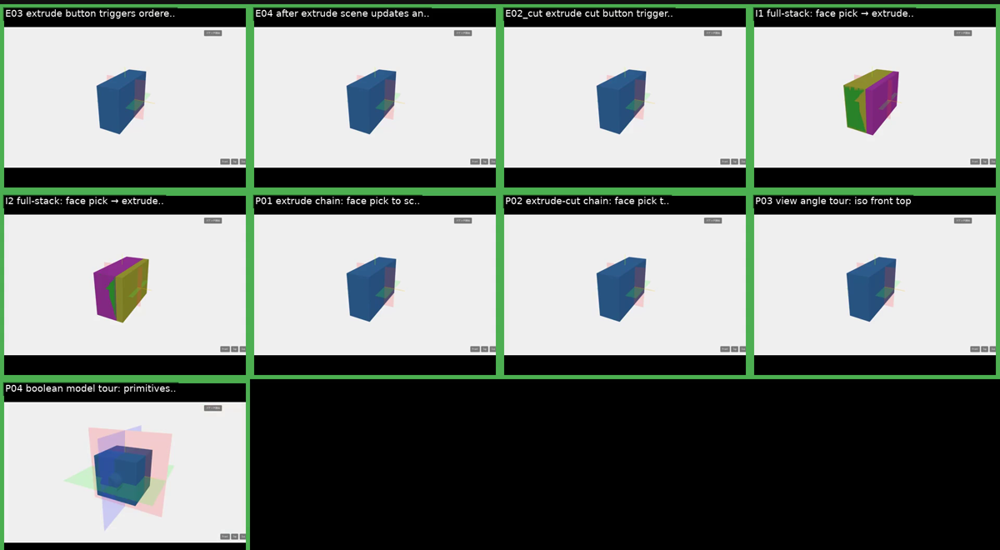

# EngawaCAD

オープンソースの B-rep (Boundary Representation) CAD カーネル。Rust 製。



*acceptance テストの自動収録から生成した機能ツアー。スケッチ→押出 (E03/E04/P01) / 押出カット (E02_cut/P02) / 面ピック (I1/I2) / 視点切替 (P03) / Boolean + 参照平面 (P04) を網羅。*

## Features

- **B-rep カーネル**: Solid, Shell, Face, Edge, Vertex によるトポロジー表現
- **パラメトリック履歴**: Feature ベースのモデリング（操作履歴が設計の源）
- **YAML フォーマット**: 人間可読・diff 可能な `.engawa` ファイル形式
- **決定的**: 同じ入力は常に同じ出力を生成
- **Boolean 演算**: `cut` / `fuse` / `intersect`
- **スケッチ + 押出**: 正準平面 (xy/xz/yz) 上の線分プロファイルから `extrude` / `extrude_cut`
- **Web ビューア**: ブラウザでリアルタイム 3D 表示・面ピック・対話編集
- **テッセレーション**: B-rep からトライアングルメッシュ (STL 出力可)

## Quick Start

```bash
# ビルド
cargo build --release

# .engawa ファイルを STL に変換
./target/release/engawa export examples/simple_box.engawa -o box.stl

# ブラウザでリアルタイム 3D 表示 (Phase 7 完成形: スケッチ→押出)
./target/release/engawa view examples/sketch_via_refplane.engawa
```

サンプル一覧は [`examples/README.md`](examples/README.md) を参照。

### Development

```bash
# テスト
cargo test --workspace

# CI チェック（fmt + clippy + test + build + web）
cargo xtask ci

# Playwright E2E + 動画収録 (上記ヒーロー画像はこの出力から生成)
cargo xtask acceptance --record
```

## Roadmap

開発はフェーズ単位で進めています。現状と今後の予定は [`ROADMAP.md`](ROADMAP.md) を参照。

- ✅ Phase 0: 基盤 (B-rep カーネル + YAML フォーマット)
- ✅ Phase 1: `.engawa` から STL を出力
- ✅ Phase 2: Web ビューア基盤
- ✅ Phase 3: 円柱・球・押し出し
- ✅ Phase 4: Boolean 演算 (`cut` / `fuse` / `intersect`)
- ✅ Phase 5: アセンブリと部品参照
- ✅ Phase 6: 面ピック + 押出/押出カット
- ✅ Phase 7: スケッチ描画（正準平面）
- ⏳ Phase 8: モデル面上のスケッチ
- ⏳ Phase 9: STEP export (低優先度)

## Project Structure

```
crates/
├── engawa-kernel/     B-rep 幾何カーネル
├── engawa-format/     .engawa ファイルのスキーマ・パーサー
├── engawa-build/      Feature ディスパッチャー (format → kernel)
├── engawa-api/        HTTP API サーバ (ビューア・対話編集の背骨)
├── engawa-cli/        コマンドラインインターフェース
├── engawa-viewer/     3D ビューア (Tauri 化を見据えた layer)
└── xtask/             ビルド自動化タスク

web/                   ブラウザフロント (Vite + Three.js + Playwright)
examples/              .engawa サンプル集 (一覧は examples/README.md)
docs/                  ADR・runbook・画像
```

## License

MIT OR Apache-2.0
